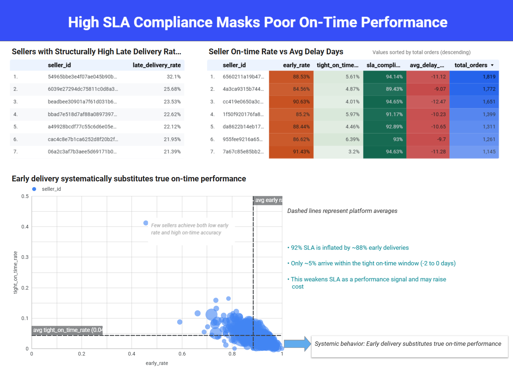
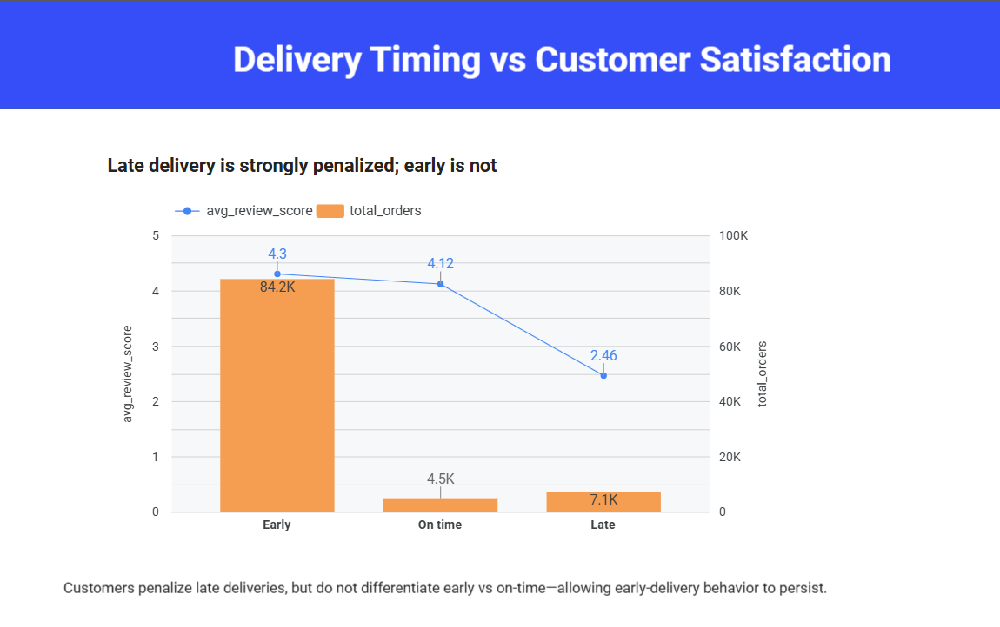

# Olist Delivery Reliability Analysis

🔗 **Dashboard (Looker Studio):** [View here]ttps://lookerstudio.google.com/reporting/c0ef3eb4-75c8-497a-9b7e-03b593a42f11

🧰 **Tools:** SQL (BigQuery), Looker Studio, Python, Excel  

📅 **Date:** Jan 2026

---

## Business Problem

Many Olist dashboards focus on **sales performance and top-selling products**.  
However, **fulfillment reliability** and **delivery SLA design** are equally critical to customer experience and operational efficiency.

This project focuses on answering three key questions:

- Does high SLA compliance truly mean deliveries are on time?
- What behaviors are hidden behind headline SLA metrics?
- How does delivery timing impact customer satisfaction?

---

## Executive Summary (Key Insight)

Headline SLA compliance can be **misleading**.

Although overall SLA compliance appears strong (92%), the majority of deliveries arrive **systematically early**, not truly on time.  
This inflates SLA performance and masks underlying fulfillment inefficiencies, weakening SLA as a meaningful performance signal.

---

## Key Findings

- Delivery KPIs were redefined into **Early / Tight On-Time (-2 to 0 days) / Late** to separate true punctuality from early arrivals.
- Early deliveries dominate the dataset and **distort SLA interpretation**.
- Late deliveries are **strongly penalized** in customer reviews, while early deliveries are not.
- Seller-level patterns reveal **structural reliability issues** among a subset of sellers with consistently high late delivery rates.

---

## Dashboard Highlights

### Overall Delivery Reality

- Total delivered orders: **96,476**
- SLA compliance: **92.43%**
- True on-time rate (tight window): **4.72%**
- Early delivery rate: **87.70%**
- Late delivery rate: **7.57%**

> SLA looks strong, but true punctuality is extremely low.

---

### SLA Compliance vs True On-Time Performance

- Sellers with high SLA compliance often rely on **systematic early delivery**.
- Early delivery substitutes true on-time performance rather than improving it.
- This behavior weakens SLA as a reliable operational KPI and may increase hidden costs.

---

### Delivery Timing vs Customer Satisfaction

- Late deliveries cause a **significant drop** in average review scores.
- Early and on-time deliveries receive **similar customer ratings**.
- Customers penalize lateness, but do not reward early delivery.

---

## Recommendations

- **Redesign SLA KPIs** to clearly separate true punctuality from systematic earliness.
- **Introduce operational thresholds** for early delivery to control cost and efficiency impact.
- **Prioritize interventions** for sellers with structurally high late delivery rates.
- Use refined KPIs to improve fulfillment reliability rather than headline SLA scores.

---

## Contact

🔗 **LinkedIn**: https://www.linkedin.com/in/ling-li-data

---

## Dashboard Screenshots

### Overall Delivery Reality

---
### SLA Compliance vs True On-time

---
### Delivery Timing vs Customer Satisfaction

